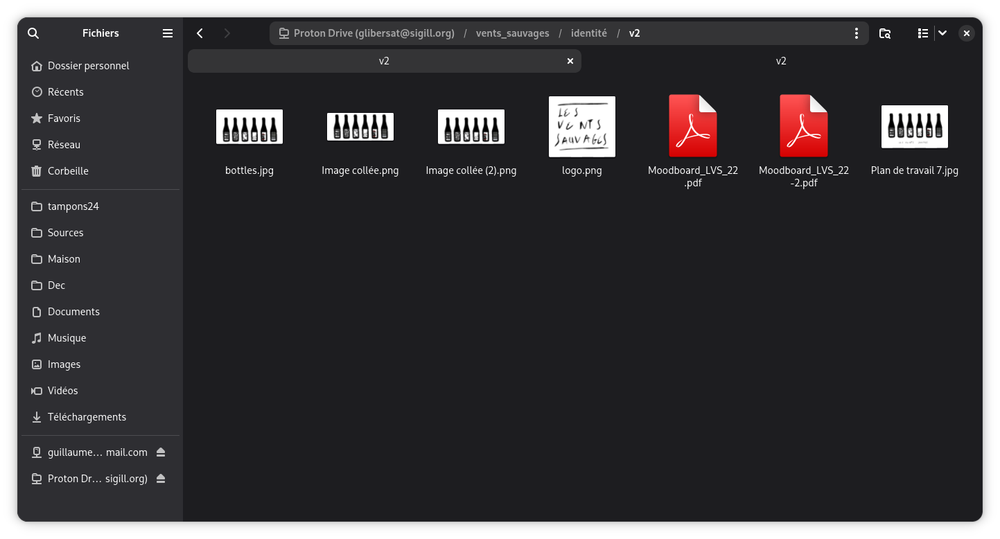

# Gnome Proton Drive

> **Unofficial project.** This is not affiliated with or endorsed by Proton AG.
> It exists out of personal frustration waiting for an official Linux client —
> use it at your own risk.

> **Alpha.** This project is in early development. Reading, creating directories,
> and uploading files are working; moves and renames are still pending upstream
> support. Expect rough edges and breaking changes between commits.

A native GNOME integration for Proton Drive, exposing it as a mounted volume
in Nautilus and GTK file choosers.



## Architecture

```
Nautilus / GTK file choosers
        ↕ GIO volume monitor
gvfsd-proton-volume-monitor  (Vala, GVfs remote volume monitor)
        ↕ libsecret + org.gnome.ProtonDrive D-Bus
proton-drive-setup  (Python GTK wizard)
        ↕ GVfs VFS ops
gvfsd-proton  (C, GVfs backend)
        ↕ Unix socket — line-delimited JSON-RPC
proton-drive-helper  (Go binary)
        ├── EventPoller     (volume events, 30 s poll)
        ├── MetaCache       (in-memory, event-invalidated)
        ├── BlockCache      (~/.cache/proton-drive/…/blocks/)
        ├── ThumbnailCache  (~/.cache/proton-drive/…/thumbnails/)
        └── ↕ HTTPS + E2E encryption
Proton Drive API
```

The Go helper owns authentication, key management, and all Proton Drive API
calls using [go-proton-api](https://github.com/ProtonMail/go-proton-api).
`gvfsd-proton` translates GVfs operations into RPC calls, making the drive
appear as a native volume. The backend spawns the helper automatically on
mount.

`gvfsd-proton-volume-monitor` is a GVfs remote volume monitor daemon that
watches the GNOME keyring and `org.gnome.ProtonDrive` D-Bus signals so
accounts appear automatically in Nautilus without a manual `gio mount`. See
`docs/volume-monitor.md` for the architecture.

Directory listings and file metadata are cached in-process, invalidated by
the event poller when remote changes arrive. Decrypted file content is cached
on disk under `~/.cache/proton-drive/<account>/` so repeated reads and offline
access work without hitting the network. See `docs/caching.md` for details.

## Building

### Prerequisites

- Go 1.22+
- GLib/GIO 2.76+, json-glib 1.0 (headers + dev packages)
- GVfs 1.57 (runtime libraries: `libgvfsdaemon.so`, `libgvfscommon.so`)
- libsecret 0.20+ (headers + dev packages)
- Vala 0.56+
- Meson 1.0+ and Ninja

### Build everything

```sh
make
```

### Build components individually

```sh
# Go helper only
make build-helper

# C backend only (configures Meson into _build/ on first run)
make build-backend

# Vala volume monitor only (configures Meson into _build-monitor/ on first run)
make build-monitor
```

## Installation

```sh
sudo make install
```

This installs:
- `proton-drive-helper` → `/usr/local/libexec/`
- `gvfsd-proton` → GVfs backend directory (via `meson install`)
- `proton.mount` → GVfs mounts directory
- `gvfsd-proton-volume-monitor` → `/usr/local/libexec/`
- `proton.monitor` → GVfs remote volume monitors directory
- `proton-drive-setup` → `/usr/local/bin/`

Override `PREFIX` or `DESTDIR` as needed:

```sh
sudo make install PREFIX=/usr
make install DESTDIR=/tmp/pkg PREFIX=/usr
```

After installing, restart `gvfsd` so it picks up the new mount type:

```sh
pkill gvfsd; gvfsd &    # or log out and back in
```

## First mount

**1. Run the setup wizard:**

```sh
proton-drive-setup
```

This opens a GTK dialog asking for your email and password, performs SRP
login via `proton-drive-helper`, and stores the session tokens (`uid`,
`refresh_token`, `salted_passphrase`) in the GNOME keyring. The password is
never written to disk.

**2. Mount the drive:**

After running the setup wizard, `gvfsd-proton-volume-monitor` detects the new
keyring entry and the volume appears automatically in Nautilus. Click it to
mount, or mount from the command line:

```sh
gio mount "proton://you%40proton.me/"
```

The `@` in the email must be percent-encoded as `%40` so GVfs passes it
through as the host field.

`gvfsd-proton` will spawn `proton-drive-helper`, wait for the socket,
authenticate, and the volume will appear in Nautilus as
**Proton Drive (you@proton.me)**. Browsing directories and opening files
works read-only at this stage.

**3. Unmount:**

```sh
gio mount -u "proton://you%40proton.me/"
```

## Testing

```sh
make test          # Go unit tests (with -race) + Meson backend tests
make test-helper   # Go only
make test-backend  # C backend only
```

## RPC protocol reference

See [docs/rpc-api.md](docs/rpc-api.md) for the full method and error code reference.

## Status

| Feature | Status |
|---|---|
| Authentication + key unlock | ✅ |
| List directory | ✅ |
| Stat file/directory | ✅ |
| Read file (streaming, offset-aware, decrypted) | ✅ |
| Metadata cache (event-invalidated, offline fallback) | ✅ |
| Block cache (per-block, persistent, 2 GiB LRU, offline reads) | ✅ |
| Thumbnails (server-side, cached, shown in Nautilus) | ✅ |
| GVfs C backend (read-only) | ✅ |
| Delete / trash | ✅ (helper only — not exposed via GVfs yet) |
| Create directory | ✅ |
| Write file | ✅ (buffer-then-upload; full E2E crypto + Verifier token) |
| Move / rename | ⏳ Blocked on `MoveLink` in go-proton-api |
| GNOME volume monitor | ✅ Implemented (libsecret + D-Bus watch, auto-appears in Nautilus) |
| Event polling (remote → Nautilus) | ✅ Volume-level, anchor-persisted, full paging via `go-proton-api` |
| Block cache re-encryption | 🔲 Currently stored as plaintext |
| Pinned offline files | 🔲 Not started |
| GNOME Online Accounts integration | 🔲 Future (post-M3) |

## Known limitations

- **No move / rename.** `MoveLink` is missing from go-proton-api; passphrase
  re-encryption under the new parent `NodeKey` is also needed. Tracked in the
  roadmap under B3.
- **Volume monitor requires restart.** After `make install`, GIO must pick up
  the new `proton.monitor` descriptor. Log out and back in, or restart
  `gvfsd` and the volume monitor daemon.
- **Block cache stores plaintext.** Decrypted file content is written to
  `~/.cache/proton-drive/` without re-encryption. Rely on OS full-disk
  encryption until this is addressed.
- **Session token TTL unknown.** Re-authentication UX (silent refresh vs.
  re-prompt dialog) is not yet determined.
